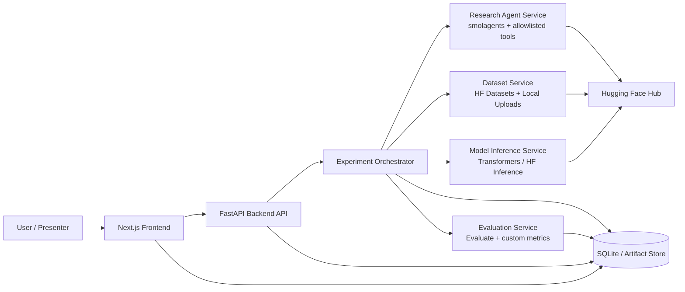
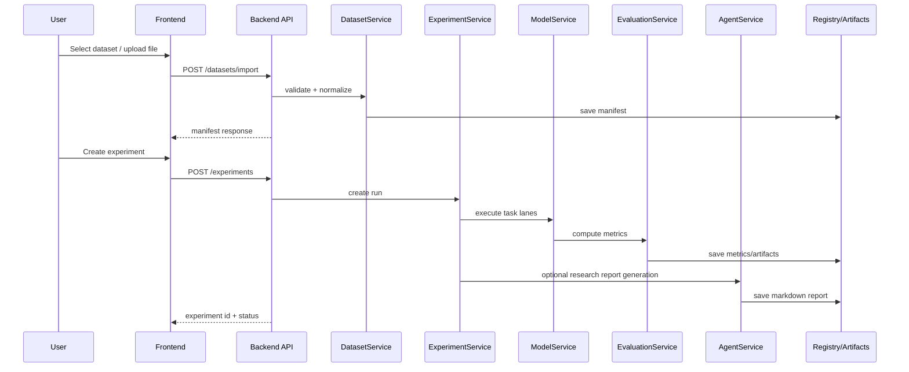

# LLM Insight Studio — Master Product Specification

> **Document Type:** Unified PRD + SDD + System Architecture + AI Agent Blueprint  
> **Version:** 1.0.0  
> **Audience:** Student team, AI coding assistants, GitHub Copilot, VS Code, reviewers, instructor  
> **Repository Style:** Monorepo  
> **Primary Language of Implementation:** English  
> **Presentation / Paper Language:** English (recommended), Arabic summary optional  
> **Target Use Case:** Comparative analysis of three popular LLM families in NLP through a professional research-grade web app demo.

---

## 1) Executive Summary

**LLM Insight Studio** is a full-stack research and product-demo platform that ingests public NLP datasets and/or uploaded user feedback, evaluates multiple language-model families across real NLP tasks, and exposes the results through a professional dashboard, explainable reports, and an AI research agent.

The platform is designed to satisfy the following academic objectives simultaneously:

1. Analyze at least **three major LLM/model families** in NLP.
2. Demonstrate understanding of **core algorithms and key concepts**.
3. Show **real application value** through an app demo.
4. Use **public datasets** and reproducible evaluation.
5. Produce an artifact that is strong enough for both a **research paper** and a **live demonstration**.

### Chosen Model Families

To balance academic rigor, implementation realism, and low engineering friction, the platform uses the following **three model families** through Hugging Face:

1. **BERT family** for text understanding and classification.
2. **T5 / FLAN-T5 family** for summarization and text-to-text transformations.
3. **Instruction-tuned decoder LLM family** for interactive analysis and question answering.
   - Default recommended development model: **Qwen2.5 Instruct** or **Mistral Instruct** on Hugging Face for easier access.
   - Optional advanced model for paper comparison: **Llama 3.x Instruct** if the team has access and hardware budget.

### Primary Product Theme

**Customer Feedback Intelligence / Review Analytics / Student Feedback Intelligence**

The user uploads text data or selects benchmark datasets; the system then:
- classifies sentiment and complaint type,
- summarizes key patterns,
- answers natural-language questions about the dataset,
- compares models quantitatively and qualitatively,
- produces exportable reports with references and provenance.

---

## 2) Product Vision

### Vision Statement

Build a professional, research-grade NLP analytics platform that compares multiple LLM families in practical workflows and explains where each family performs best.

### Why this product is strategically strong

This concept is stronger than a simple chatbot because it combines:
- **research methodology**,
- **benchmarking**,
- **real user value**,
- **explainability**,
- **interactive demo value**,
- **agent-assisted automation**.

### Value Proposition

For a dataset of reviews, comments, or feedback, the platform answers:
- What is the overall sentiment?
- What are the dominant complaint themes?
- What should management care about first?
- Which model is best for which task?
- What evidence supports that conclusion?

---

## 3) Product Goals, Non-Goals, and Success Criteria

### 3.1 Goals

1. Support **benchmark dataset ingestion** from Hugging Face Datasets.
2. Support **manual file upload** (CSV/JSON/XLSX) for demos.
3. Run **three task lanes**:
   - sentiment/classification,
   - summarization,
   - QA / interactive insights.
4. Compare models on:
   - quality,
   - latency,
   - resource cost,
   - output consistency,
   - explainability.
5. Generate a **research-ready report** with citations, benchmark snapshots, and reproducible metadata.
6. Provide an **AI Research Agent** that fetches datasets/resources, drafts experiment plans, and writes markdown reports with provenance.

### 3.2 Non-Goals

1. Not a general-purpose chat assistant for arbitrary life questions.
2. Not a production customer-support platform with account management.
3. Not a full fine-tuning lab in v1.
4. Not a multi-tenant SaaS platform.
5. Not a social feed or collaboration tool.

### 3.3 Success Criteria

The project is successful if:
- a user can upload a dataset and receive insights in under 2–5 minutes for demo-size inputs,
- the app clearly compares three model families,
- results are reproducible and exportable,
- the paper can directly cite the app’s evaluation tables and report outputs,
- the team can present a polished end-to-end demo without brittle manual steps.

---

## 4) Target Users and Personas

### Persona A — Research Student
- Wants a reproducible way to compare LLMs.
- Needs plots, metrics, and exportable tables.
- Cares about references, methodology, dataset provenance.

### Persona B — Instructor / Evaluator
- Wants clear project scope, architecture, and outcomes.
- Cares about rigor, structure, deliverables, and research validity.

### Persona C — Business Stakeholder (demo persona)
- Wants a polished dashboard.
- Cares about actionable insights, not raw logits.

### Persona D — AI Coding Assistant (non-human persona)
- Must generate code with minimal ambiguity.
- Requires explicit contracts, directory rules, naming, API shapes, test expectations.

---

## 5) Problem Statement

Students often build LLM projects that are either:
- too theoretical and not demoable,
- too product-oriented and not academically rigorous,
- too broad and impossible to finish,
- or too dependent on external APIs and difficult to reproduce.

This product resolves that by:
- centering on **standard NLP tasks**,
- using **Hugging Face-first tooling**,
- keeping model access swappable,
- enforcing **clear artifacts, evaluation, and provenance**,
- and introducing a controlled AI agent for automation rather than chaos.

---

## 6) Product Scope

### 6.1 Core MVP Scope

#### Inputs
- Hugging Face benchmark dataset selection.
- Local file upload: CSV, JSON, XLSX.
- Optional free-text pasted document.

#### Processing
- Dataset normalization.
- Sampling and chunking.
- Task routing by pipeline type.
- Model inference.
- Metric computation.
- Result caching.
- Research report generation.

#### Outputs
- Dashboard cards.
- Charts and model comparison tables.
- Summaries and QA answers.
- Exportable markdown / PDF-ready report.
- Paper-ready tables.

### 6.2 v1.1 Scope
- Authentication (simple local auth or demo auth).
- Saved experiments.
- Report version history.
- Benchmark preset packs.
- More tasks (topic extraction, NER, translation).

### 6.3 Future Scope
- Human evaluation workflows.
- Fine-tuning / PEFT experiments.
- Arabic NLP lane.
- multilingual analytics.
- RAG with vector search over uploaded corpora.

---

## 7) Functional Requirements

### FR-1 Dataset Ingestion
The system shall allow users to:
1. select a Hugging Face dataset preset,
2. upload a local dataset,
3. preview schema and sample rows,
4. map text column(s) and label column(s),
5. define task lane(s) to run.

**Acceptance criteria**
- User can select `rotten_tomatoes`, `rajpurkar/squad`, and one summarization dataset preset.
- User can upload a CSV with at least one text column.
- The backend validates schema and returns a normalized dataset manifest.

### FR-2 Sentiment / Classification Lane
The system shall run a classification model over selected records and produce:
- label distribution,
- confidence scores,
- confusion matrix (if ground truth exists),
- per-example outputs,
- aggregate summary.

### FR-3 Summarization Lane
The system shall summarize:
- full corpus sample,
- negative comments only,
- per-cluster/per-topic subsets,
- per-batch rolling summary.

### FR-4 QA / Interactive Insights Lane
The system shall answer natural-language questions against the selected corpus or evaluation context.

Capabilities:
- question over benchmark context,
- question over uploaded comments,
- evidence snippets returned with answer,
- citation-like provenance to supporting records.

### FR-5 Model Comparison Workspace
The system shall compare candidate models by:
- task,
- quality metrics,
- latency,
- token count estimate,
- failure cases,
- recommended use-case.

### FR-6 AI Research Agent
The system shall include an AI agent able to:
1. search and fetch benchmark datasets and their metadata,
2. fetch model cards / official documentation references,
3. build an experiment plan,
4. draft a markdown report,
5. compile references and resource links,
6. produce a final research brief with provenance.

### FR-7 Report Export
The system shall export:
- markdown report,
- JSON experiment artifact,
- chart images,
- paper-ready table snippets.

### FR-8 Experiment Registry
The system shall store experiment metadata:
- dataset id and version/snapshot,
- selected task,
- model ids,
- generation parameters,
- metric bundle,
- date/time,
- user notes,
- report path.

---

## 8) Non-Functional Requirements

### NFR-1 Reliability
- API endpoints must fail gracefully.
- Invalid model calls must return structured error responses.
- Frontend must surface actionable user messages.

### NFR-2 Reproducibility
Each experiment must persist:
- model identifier,
- model revision if available,
- dataset identifier and split,
- preprocessing options,
- generation parameters,
- timestamp,
- git commit SHA if present.

### NFR-3 Performance
For demo-scale workloads:
- preview operations < 3s,
- experiment kickoff < 2s,
- medium benchmark run (sampled) < 5 minutes,
- cached report retrieval < 2s.

### NFR-4 Security
- No arbitrary code execution from the web UI.
- AI agent uses allowlisted tools only.
- Uploaded files are validated and size-limited.
- Secret keys remain server-side.

### NFR-5 Maintainability
- Monorepo with clear module boundaries.
- Strong schema contracts.
- Typed API payloads.
- Deterministic tests for adapters and services.

### NFR-6 Explainability
- Every major result must have provenance.
- QA answers must include evidence snippets.
- Reports must contain model + dataset references.

### NFR-7 Accessibility
- Keyboard navigation.
- semantic HTML.
- WCAG-friendly contrast.
- charts with textual summaries.

---

## 9) Recommended Tech Stack

### Frontend
- **Next.js (App Router)**
- TypeScript
- Tailwind CSS
- shadcn/ui
- Recharts
- TanStack Table
- Zod for schema guards (optional on client)

### Backend
- **FastAPI**
- Python 3.11+
- Pydantic v2
- httpx
- orjson
- uvicorn
- SQLModel or SQLAlchemy

### ML / Data Layer
- `transformers`
- `datasets`
- `evaluate`
- `huggingface_hub`
- `smolagents`
- `accelerate` (optional)
- `sentence-transformers` (optional future RAG)

### Storage
- SQLite for v1 local registry
- Local filesystem for reports/artifacts
- Optional PostgreSQL for team mode

### Background Tasks
- FastAPI BackgroundTasks for v1
- Optional Celery / Dramatiq / RQ in v1.1+

### Quality
- pytest
- pytest-asyncio
- ruff
- mypy
- eslint
- prettier
- playwright

---

## 10) High-Level Architecture



### Architecture Principles

1. **Frontend is presentation + interaction only.**
2. **Backend owns orchestration, validation, security, persistence.**
3. **Model access is wrapped behind provider abstractions.**
4. **Agent is isolated from the main request path where possible.**
5. **All experiments create immutable artifacts.**
6. **Every report contains provenance metadata.**

---

## 11) Monorepo Structure

```text
repo/
├─ apps/
│  ├─ web/                        # Next.js frontend
│  └─ api/                        # FastAPI backend
├─ packages/
│  ├─ ui/                         # shared frontend components (optional)
│  ├─ schemas/                    # shared JSON/OpenAPI/Zod schemas
│  └─ prompts/                    # agent prompts and templates
├─ services/
│  ├─ ml/                         # model wrappers, task pipelines
│  ├─ data/                       # dataset adapters, normalization, loaders
│  ├─ evaluation/                 # metrics and experiment scoring
│  └─ agent/                      # smolagents tools, orchestration, report writer
├─ artifacts/
│  ├─ experiments/
│  ├─ reports/
│  └─ charts/
├─ docs/
│  ├─ MASTER_SPEC.md
│  ├─ api/
│  └─ adrs/
├─ .github/
│  └─ instructions/
└─ agent.md
```

---

## 12) Frontend Architecture

### 12.1 Frontend Responsibilities
- dataset selection and upload flows,
- experiment creation wizard,
- live status view,
- results dashboard,
- comparison view,
- report rendering and export actions.

### 12.2 Frontend Route Map

```text
/                               # landing / dashboard
/datasets                       # choose benchmark or upload data
/experiments/new                # create experiment
/experiments/[id]               # experiment details + status
/compare                        # comparison workspace
/reports/[id]                   # markdown-like report viewer
/settings                       # model/provider configuration
```

### 12.3 UI Modules
- `DatasetPicker`
- `UploadDropzone`
- `SchemaMapper`
- `ExperimentWizard`
- `TaskLaneSelector`
- `ModelSelector`
- `MetricCards`
- `ComparisonTable`
- `EvidencePanel`
- `ResearchReportViewer`
- `RunStatusTimeline`

### 12.4 State Strategy
- server state: React Query or native App Router fetching patterns.
- local form state: React Hook Form + Zod.
- global lightweight UI state: Zustand only if truly needed.

### 12.5 UX Requirements
- Every long-running action must show progress.
- Every result page must explain what was executed.
- Every metric must have tooltip definitions.
- Empty states must teach the user what to do next.

---

## 13) Backend Architecture

### 13.1 Backend Layers

```text
api/
├─ routers/        # FastAPI routes
├─ schemas/        # pydantic request/response models
├─ services/       # use-case orchestration
├─ repositories/   # DB and artifact access
├─ core/           # settings, logging, auth, errors
├─ workers/        # background execution entrypoints
└─ main.py
```

### 13.2 Core Services

1. **DatasetService**
   - load preset dataset
   - inspect dataset metadata
   - validate uploaded files
   - normalize columns
   - sample / split / chunk

2. **ModelService**
   - route task to appropriate wrapper
   - manage local vs remote inference
   - apply batching and truncation rules
   - capture latency and error telemetry

3. **EvaluationService**
   - compute task-specific metrics
   - collect qualitative examples
   - build summary judgments

4. **ExperimentService**
   - create experiment record
   - enqueue run
   - persist outputs
   - expose progress + results

5. **ResearchAgentService**
   - invoke smolagents with allowlisted tools
   - gather references
   - write markdown report
   - validate report provenance

6. **ArtifactService**
   - save charts / tables / JSON artifacts
   - save markdown report
   - return artifact manifests

---

## 14) AI Agent Architecture

### 14.1 Why the project needs an agent

The agent is not included for gimmick value. It exists to automate the most error-prone and time-consuming academic work:
- finding datasets,
- reading model cards,
- collecting references,
- generating experiment plans,
- drafting report sections,
- linking claims to sources.

### 14.2 Recommended Agent Framework

Use **Hugging Face smolagents**.

### 14.3 Recommended Agent Type

**Default:** `ToolCallingAgent`

Why:
- lower risk of invalid free-form code,
- structured tool I/O,
- safer execution,
- easier validation,
- less conflict when AI generates code around it.

**Optional advanced mode:** `CodeAgent` only inside a sandboxed execution environment for controlled report synthesis or data transformations.

### 14.4 Agent Roles

#### A. Dataset Scout Agent
- searches benchmark datasets,
- inspects task compatibility,
- returns top candidates.

#### B. Reference Curator Agent
- fetches model docs, official papers, and task docs,
- extracts title / URL / summary / relevance.

#### C. Experiment Planner Agent
- proposes benchmark-task-model matrix,
- defines metrics,
- drafts evaluation methodology.

#### D. Report Writer Agent
- composes markdown report with sections,
- inserts references and provenance,
- creates caveats and limitations.

### 14.5 Agent Toolset (allowlist only)

1. `search_hf_datasets(query, task, language)`
2. `get_dataset_info(dataset_id)`
3. `sample_dataset_rows(dataset_id, split, n)`
4. `search_hf_models(query, task)`
5. `get_model_card(model_id)`
6. `fetch_official_doc(url)`
7. `write_markdown_report(path, content)`
8. `validate_references(report_markdown)`
9. `save_experiment_plan(plan_json)`

### 14.6 Agent Guardrails

- Never fabricate references.
- Never cite undocumented metrics.
- Never claim a dataset was used unless its manifest exists.
- Never claim a model was benchmarked unless experiment artifacts exist.
- If sources conflict, mark the claim as unresolved.
- If the answer cannot be grounded, the agent must say so.

### 14.7 Agent Output Contract

Every generated report must include:
- title,
- objective,
- selected models,
- selected datasets,
- methodology,
- metrics,
- findings,
- limitations,
- references,
- provenance appendix.

---

## 15) Data Architecture

### 15.1 Canonical Entities

#### DatasetManifest
```json
{
  "dataset_id": "string",
  "source": "hf|upload",
  "task": ["classification", "summarization", "qa"],
  "splits": ["train", "validation", "test"],
  "text_columns": ["text"],
  "label_columns": ["label"],
  "row_count": 0,
  "license": "string|null",
  "snapshot": "string|null"
}
```

#### ExperimentRun
```json
{
  "id": "uuid",
  "created_at": "ISO8601",
  "dataset_manifest_id": "uuid",
  "task_lane": "classification|summarization|qa|multi",
  "models": ["string"],
  "params": {},
  "status": "queued|running|completed|failed",
  "metrics": {},
  "artifacts": []
}
```

#### EvidenceSnippet
```json
{
  "record_id": "string",
  "text": "string",
  "score": 0.0,
  "source_split": "train|test|validation|upload",
  "metadata": {}
}
```

### 15.2 Data Flow



---

## 16) Model Strategy and Task Mapping

### 16.1 Task-to-Model Mapping

| Task | Primary Family | Recommended v1 Model | Fallback | Notes |
|---|---|---|---|---|
| Sentiment / classification | BERT-family | `distilbert-base-uncased-finetuned-sst-2-english` | `cardiffnlp/twitter-roberta-base-sentiment-latest` | Keep classification lane deterministic and fast |
| Extractive QA | BERT/RoBERTa-family | `deepset/roberta-base-squad2` | `distilbert-base-cased-distilled-squad` | Reliable for benchmark QA |
| Summarization | T5-family | `google/flan-t5-base` | `google-t5/t5-small` | FLAN-T5 improves instruction behavior |
| Interactive dataset QA / synthesis | Instruct LLM | `Qwen/Qwen2.5-7B-Instruct` | `mistralai/Mistral-7B-Instruct-v0.3` | HF accessible default |
| Advanced optional comparison | Llama-family | `meta-llama/Llama-3.1-8B-Instruct` | N/A | Use only if access and hardware are available |

> Implementation note: keep model ids configurable through environment variables or admin settings; do not hardcode across code paths.

### 16.2 Provider Abstraction

Define a provider-neutral interface:

```python
class InferenceProvider(Protocol):
    def classify(self, texts: list[str], model_id: str, **kwargs) -> list[dict]: ...
    def summarize(self, texts: list[str], model_id: str, **kwargs) -> list[dict]: ...
    def answer(self, question: str, context: str, model_id: str, **kwargs) -> dict: ...
    def generate(self, prompt: str, model_id: str, **kwargs) -> dict: ...
```

### 16.3 Inference Modes

1. **Local Transformers mode**
   - best for small/medium CPU-friendly demos,
   - reproducible,
   - no external API costs,
   - slower for larger instruct models.

2. **Hugging Face Inference mode**
   - easier access to larger instruction models,
   - less local hardware burden,
   - network latency and quota concerns.

### 16.4 Required Model Metadata Capture

For every run capture:
- `model_id`
- `provider`
- `revision` if available
- `temperature`
- `max_new_tokens`
- `top_p`
- `truncation`
- `batch_size`
- runtime device

---

## 17) Dataset Strategy

### 17.1 Benchmark Presets

#### Sentiment / Classification
- `cornell-movie-review-data/rotten_tomatoes`
- SST-2 compatible benchmark if using GLUE workflow

#### Question Answering
- `rajpurkar/squad`

#### Summarization
- `cnn_dailymail` or another Hugging Face summarization-ready dataset
- `billsum` for smaller legal-summary experiments

### 17.2 Demo Dataset Presets
- Student course feedback CSV
- Product review CSV
- Restaurant reviews CSV
- App store review CSV

### 17.3 Normalization Rules
- normalize unicode,
- trim whitespace,
- remove empty records,
- optional deduplication,
- chunk long documents,
- preserve original row ids.

### 17.4 Task Routing Rules
- If labels exist and task = classification → compute supervised metrics.
- If context/question columns exist → QA benchmark mode.
- If long documents only → summarization mode.
- If user selects interactive mode without labels → qualitative mode + evidence retrieval.

---

## 18) Evaluation Methodology

### 18.1 Classification Metrics
- accuracy
- precision
- recall
- F1
- confusion matrix
- label coverage

### 18.2 Summarization Metrics
- ROUGE-1
- ROUGE-2
- ROUGE-L
- optional human quality checklist

### 18.3 QA Metrics
- Exact Match (EM)
- F1
- evidence hit rate (custom)

### 18.4 Product Metrics
- run duration,
- mean latency per 100 examples,
- failure rate,
- retry count,
- artifact completeness,
- user-visible clarity score (manual rubric).

### 18.5 Qualitative Evaluation Rubric

| Dimension | Description | Scale |
|---|---|---|
| Faithfulness | Does output reflect source evidence? | 1–5 |
| Relevance | Does output answer the task clearly? | 1–5 |
| Conciseness | Is the result right-sized? | 1–5 |
| Actionability | Is it useful to a stakeholder? | 1–5 |
| Explainability | Is evidence visible and understandable? | 1–5 |

---

## 19) API Design

### 19.1 REST Endpoints

#### Dataset Endpoints
- `POST /api/v1/datasets/import-upload`
- `POST /api/v1/datasets/import-hf`
- `GET /api/v1/datasets/{id}`
- `GET /api/v1/datasets/{id}/preview`
- `POST /api/v1/datasets/{id}/map-schema`

#### Experiment Endpoints
- `POST /api/v1/experiments`
- `GET /api/v1/experiments/{id}`
- `GET /api/v1/experiments/{id}/status`
- `GET /api/v1/experiments/{id}/results`
- `POST /api/v1/experiments/{id}/cancel`

#### Comparison Endpoints
- `POST /api/v1/compare`
- `GET /api/v1/compare/{id}`

#### Agent Endpoints
- `POST /api/v1/agent/research-plan`
- `POST /api/v1/agent/collect-references`
- `POST /api/v1/agent/write-report`
- `GET /api/v1/reports/{id}`

#### Artifact Endpoints
- `GET /api/v1/artifacts/{id}`
- `GET /api/v1/reports/{id}/download`

### 19.2 Example Create Experiment Request

```json
{
  "dataset_manifest_id": "uuid",
  "task_lanes": ["classification", "summarization", "qa"],
  "models": {
    "classification": "distilbert-base-uncased-finetuned-sst-2-english",
    "summarization": "google/flan-t5-base",
    "qa": "Qwen/Qwen2.5-7B-Instruct"
  },
  "sampling": {
    "max_rows": 500,
    "strategy": "stratified"
  },
  "generation": {
    "temperature": 0.2,
    "max_new_tokens": 256
  },
  "report": {
    "enabled": true,
    "include_references": true
  }
}
```

### 19.3 Example Result Bundle

```json
{
  "experiment_id": "uuid",
  "status": "completed",
  "summary": {
    "best_model_by_task": {
      "classification": "distilbert-base-uncased-finetuned-sst-2-english",
      "summarization": "google/flan-t5-base",
      "qa": "Qwen/Qwen2.5-7B-Instruct"
    }
  },
  "metrics": {
    "classification": {"accuracy": 0.91, "f1": 0.90},
    "summarization": {"rouge1": 0.41, "rougeL": 0.33},
    "qa": {"exact_match": 0.74, "f1": 0.82}
  },
  "artifacts": [
    {"type": "report_markdown", "path": "artifacts/reports/exp-001.md"},
    {"type": "chart_png", "path": "artifacts/charts/exp-001-compare.png"}
  ]
}
```

---

## 20) Core User Journeys

### Journey A — Benchmark Comparison
1. User opens app.
2. Selects benchmark preset.
3. Maps task lane.
4. Chooses model trio.
5. Starts run.
6. Views metrics, examples, charts.
7. Exports report.

### Journey B — Upload Custom Feedback
1. User uploads CSV.
2. Maps `text` and optional `label` columns.
3. Runs sentiment + summary + QA.
4. Asks “What are the top 3 complaints?”
5. Views evidence panel.
6. Shares executive summary.

### Journey C — AI-Assisted Research Drafting
1. User invokes research agent.
2. Agent fetches datasets, model cards, and official references.
3. Agent drafts methodology and resources section.
4. User reviews and exports markdown.

---

## 21) Report Generation Design

### 21.1 Report Sections
1. Title
2. Objective
3. Selected Datasets
4. Selected Models
5. Methodology
6. Preprocessing Rules
7. Evaluation Metrics
8. Quantitative Findings
9. Qualitative Findings
10. Limitations
11. Recommended Model per Task
12. References
13. Provenance Appendix

### 21.2 Report Provenance Footer
Every report must include a machine-readable footer:

```yaml
provenance:
  experiment_id: uuid
  generated_at: ISO8601
  dataset_ids:
    - rajpurkar/squad
  model_ids:
    - distilbert-base-cased-distilled-squad
    - google/flan-t5-base
    - Qwen/Qwen2.5-7B-Instruct
  code_revision: git_sha_or_unknown
  reference_count: 0
```

---

## 22) Security, Privacy, and Safety Controls

### 22.1 Secrets
- store `HF_TOKEN` only on backend side,
- never expose tokens to browser,
- `.env` excluded from version control.

### 22.2 File Upload Safety
- allow only CSV/JSON/XLSX/TXT,
- hard size limits,
- reject executables and archives in v1,
- sanitize filenames.

### 22.3 Agent Safety
- allowlisted tools only,
- no shell access,
- no unrestricted code execution in default mode,
- references must be validated before report finalization.

### 22.4 Logging Safety
- no raw secrets in logs,
- no full PII dumps,
- redact uploaded data previews if privacy mode is enabled.

---

## 23) Observability and Debuggability

### Logs
- request id,
- experiment id,
- model id,
- task lane,
- duration,
- error class,
- retry count.

### Metrics
- API latency,
- experiment queue depth,
- model call success rate,
- cache hit ratio,
- report generation success ratio.

### Debug Artifacts
- normalized dataset preview,
- generation config snapshot,
- model raw output sample,
- metric input/output bundle.

---

## 24) Testing Strategy

### 24.1 Unit Tests
- dataset adapters,
- schema mappers,
- model wrapper parameter validation,
- metrics formatters,
- report section renderers.

### 24.2 Integration Tests
- dataset import → experiment → artifact creation,
- frontend form submission → API response,
- agent tool pipeline → markdown report.

### 24.3 End-to-End Tests
- upload CSV,
- run experiment,
- open report,
- compare models,
- download artifact.

### 24.4 Golden Tests
For stable demo examples, store golden artifacts to compare:
- example summary output,
- example report structure,
- chart JSON schema.

---

## 25) Delivery Plan and Team Roles

### Team Member 1 — Research / Methodology Lead
- literature review,
- benchmark selection,
- metrics strategy,
- paper methodology,
- final discussion section.

### Team Member 2 — Data / Backend / Evaluation Lead
- dataset adapters,
- FastAPI services,
- evaluation implementation,
- experiment registry,
- artifact persistence.

### Team Member 3 — Frontend / Demo / UX Lead
- Next.js dashboard,
- result pages,
- comparison UI,
- presentation flow,
- demo-ready interactions.

### Shared Responsibilities
- model validation,
- end-to-end tests,
- final presentation,
- bug triage.

---

## 26) Work Breakdown Structure (WBS)

### Phase 1 — Definition
- finalize topic,
- approve datasets,
- freeze stack,
- define repo contracts.

### Phase 2 — Foundation
- bootstrap monorepo,
- backend skeleton,
- frontend shell,
- settings and environment setup.

### Phase 3 — Data + ML
- dataset importers,
- pipeline wrappers,
- evaluation service,
- experiment registry.

### Phase 4 — Agent + Reporting
- tool definitions,
- research plan agent,
- references collector,
- markdown report writer.

### Phase 5 — Dashboard + Comparison
- charts,
- experiment detail page,
- report viewer,
- evidence panel.

### Phase 6 — Testing + Polish
- E2E flows,
- observability,
- demo data,
- presentation script.

---

## 27) Milestones

### Milestone 1 — Proposal Ready
- architecture approved,
- datasets chosen,
- deliverables listed.

### Milestone 2 — Baseline Pipelines Running
- classification lane works,
- summarization lane works,
- QA lane works.

### Milestone 3 — Comparison Dashboard Live
- model selector,
- metrics cards,
- comparison table,
- evidence panel.

### Milestone 4 — Research Agent Produces Report
- dataset recommendations,
- references section,
- methodology draft,
- exportable markdown.

### Milestone 5 — Demo Complete
- polished UI,
- stable backend,
- reproducible experiments,
- final paper tables generated.

---

## 28) Risks and Mitigations

### Risk 1 — Model availability issues
**Mitigation:** provider abstraction + fallback model ids.

### Risk 2 — Long inference times
**Mitigation:** sampling presets, caching, background jobs, CPU-friendly defaults.

### Risk 3 — Agent hallucinated references
**Mitigation:** strict validation and source registry before final export.

### Risk 4 — Frontend/backend mismatch
**Mitigation:** OpenAPI schema generation + typed client + contract tests.

### Risk 5 — Scope explosion
**Mitigation:** freeze MVP; all extras require issue approval.

### Risk 6 — Reproducibility failure
**Mitigation:** immutable experiment manifests and artifact registry.

---

## 29) Implementation Notes for AI Coding Assistants

1. Never create cross-layer shortcuts.
2. Do not call Hugging Face directly from the browser.
3. All model calls must flow through backend adapters.
4. Every endpoint must use typed request/response schemas.
5. Every long-running action must have status polling.
6. Every report section must be generated from structured data, not ad-hoc strings.
7. Any new feature must add tests, docs, and error states.
8. If a requirement is unclear, prefer a small, testable implementation over speculative complexity.
9. Keep architecture composable: `router -> service -> repository/provider`.
10. Never hide errors; translate them into typed API errors.

---

## 30) Recommended Initial Repository Setup

```text
apps/web        => Next.js app router frontend
apps/api        => FastAPI backend
services/ml     => Hugging Face model wrappers
services/data   => dataset ingestion and normalization
services/agent  => smolagents tools and orchestration
services/evaluation => metric computation and scoring
artifacts/      => generated reports/charts/json
```

---

## 31) References and Resource Index

### Official Documentation
- Hugging Face Datasets docs: https://huggingface.co/docs/datasets/index
- Hugging Face dataset loading guide: https://huggingface.co/docs/datasets/loading
- Hugging Face Transformers pipelines docs: https://huggingface.co/docs/transformers/main_classes/pipelines
- Hugging Face task guide for question answering: https://huggingface.co/docs/transformers/tasks/question_answering
- Hugging Face Evaluate docs: https://huggingface.co/docs/evaluate/index
- Hugging Face choosing metrics guide: https://huggingface.co/docs/evaluate/en/choosing_a_metric
- Hugging Face smolagents docs: https://huggingface.co/docs/smolagents/index
- Hugging Face smolagents guided tour: https://huggingface.co/docs/smolagents/guided_tour
- FastAPI tutorial: https://fastapi.tiangolo.com/tutorial/
- Next.js App Router docs: https://nextjs.org/docs/app

### Foundational Model References
- BERT (Google Research): https://research.google/pubs/bert-pre-training-of-deep-bidirectional-transformers-for-language-understanding/
- T5 code/paper repository: https://github.com/google-research/text-to-text-transfer-transformer
- Llama 3 paper: https://arxiv.org/abs/2407.21783

### Suggested Benchmark Datasets
- Rotten Tomatoes / movie review sentiment (HF compatible)
- SQuAD question answering benchmark
- CNN/DailyMail or BillSum for summarization

---

## 32) Final Recommendation

For the cleanest implementation with the lowest conflict rate:

- use **Next.js** for the frontend,
- use **FastAPI** for the backend,
- use **Hugging Face Transformers + Datasets + Evaluate** for the ML core,
- use **smolagents ToolCallingAgent** for research/report automation,
- use a **strict artifact registry** for reproducibility,
- and keep the system **Hugging Face-first with pluggable providers**.

This design is strong enough for:
- a research paper,
- a professional app demo,
- AI-assisted implementation in VS Code,
- and future upgrades without rewriting the whole system.
